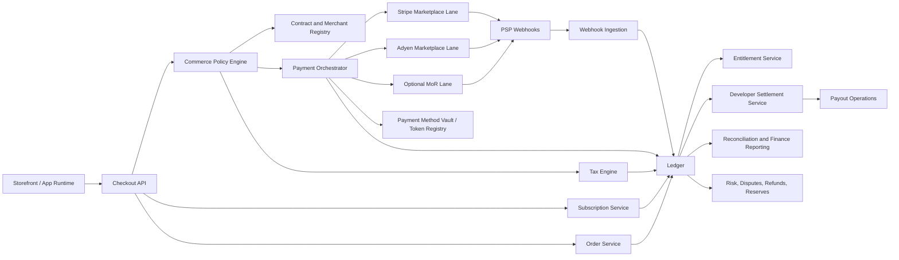

# OpenStore Global In-App Purchase and Subscription Architecture

## Purpose

OpenStore needs App Store-like commerce primitives for:

- paid apps
- consumable and non-consumable in-app purchases
- auto-renewing subscriptions
- refunds, disputes, and subscription changes
- developer revenue sharing and payouts
- region-aware tax and compliance controls

This document proposes the operating model and system architecture for managing those capabilities across global payment infrastructures.

## Executive Summary

OpenStore should not treat "global payments" as a single PSP integration problem.
It is a contract-routing and money-movement problem with payment rails underneath it.

The recommended model is:

1. Run a **marketplace lane** for third-party apps and IAP, where OpenStore controls the storefront, ledger, entitlement lifecycle, and developer settlements.
2. Keep an optional **merchant-of-record lane** only for OpenStore-owned digital products or early-country experiments where outsourcing tax and dispute liability is worth losing marketplace flexibility.
3. Build a **global payments control plane** that selects the legal entity, merchant account, PSP, tax mode, and payout rules per transaction.
4. Keep an internal **double-entry ledger** as the system of record. PSPs, tax tools, and banks are integrations, not sources of truth.
5. Release in phases: start with one primary marketplace PSP, then add a second acquirer and broader local payment coverage once the contract and ledger model is stable.

## Why OpenStore Needs Two Commerce Lanes

### Lane A: Marketplace Lane

Use this lane for:

- third-party app purchases
- third-party in-app purchases
- third-party subscriptions
- any transaction that creates developer revenue share or payout obligations

In this lane, OpenStore is the marketplace operator and keeps control of:

- developer onboarding and KYB/KYC
- revenue share rules
- charge/refund/dispute accounting
- payout timing and reserves
- entitlement grants and revocations

### Lane B: Merchant-of-Record Lane

Use this lane only for:

- OpenStore first-party subscriptions
- OpenStore-owned digital products
- short-term country expansion experiments where OpenStore does not yet want to own indirect tax and dispute operations

Do **not** use this lane for the core third-party marketplace.

Reason:

- Stripe Managed Payments is explicitly merchant-of-record but also explicitly says support for platforms is not included.
- Paddle is optimized for merchant-of-record billing, subscriptions, and tax, but it is not the right center of gravity for marketplace-style developer settlements.

The practical rule is simple:

**One customer receipt must belong to exactly one merchant-of-record and one settlement model.**

Do not mix a merchant-of-record subscription engine with OpenStore-managed developer revenue sharing inside the same order.

## Recommended Provider Strategy

### Primary Marketplace Stack

- **Stripe Connect + Billing + Tax/Radar**
  - Best first launch option for marketplace onboarding, split payments, developer payouts, subscriptions, and fast implementation.
  - Strong fit for North America, Europe, and ANZ launch countries.
  - Good default for web and mobile purchase surfaces.

### Secondary Marketplace Stack

- **Adyen**
  - Add as a second marketplace/acquiring lane after the OpenStore ledger and settlement model are stable.
  - Best used for additional local method coverage, enterprise-grade authorization optimization, and acquirer diversification.

### Optional Merchant-of-Record Stack

- **Stripe Managed Payments** or **Paddle**
  - Only for first-party digital sales or temporary market-entry shortcuts.
  - Not for the long-term third-party marketplace settlement path.

### Tax and Filing Support

- **Start** with the tax capability bundled with the primary PSP where possible.
- **Move** to a dedicated tax engine such as **Avalara** once OpenStore operates multiple legal entities, multiple PSPs, and country-specific filing obligations at scale.

## Architecture Principles

1. Separate legal responsibility from payment routing.
2. Keep contract state versioned and queryable.
3. Use provider-hosted capabilities where they reduce regulated surface area.
4. Make the ledger the only financial source of truth.
5. Make entitlements event-driven and reversible.
6. Treat subscriptions as invoices plus schedules plus entitlements, not as a single PSP object.
7. Do not assume every local payment method supports recurring billing.
8. Do not assume every marketplace payment method supports every charge type.
9. Keep payout eligibility independent from payment authorization success.
10. Prefer modular boundaries first; split into separate services only when scale or team topology requires it.

## Target Operating Model

### Contract Graph

Each transaction should resolve through a versioned contract graph:

- `consumer_terms_version`
- `developer_distribution_agreement_version`
- `merchant_entity_id`
- `merchant_account_id`
- `psp_route_id`
- `tax_profile_id`
- `revenue_share_schedule_id`
- `refund_policy_version`
- `reserve_policy_id`
- `region_policy_id`

This gives OpenStore a consistent answer to:

- which entity sold the product
- which PSP/acquirer processed the charge
- who owes tax
- how much belongs to the developer
- when money becomes payout-eligible
- which terms governed the user and developer at the time of purchase

### Legal and Commercial Building Blocks

OpenStore should maintain these business objects explicitly:

- **Legal entities**: country or region-specific OpenStore companies
- **Merchant accounts**: PSP merchant IDs, acquiring accounts, wallet configurations
- **Storefront regions**: the customer-visible countries/currencies/languages
- **Developer payout profiles**: bank account or payout destination, currency, tax forms, withholding flags
- **Contract templates**: consumer terms, developer terms, regional policy attachments
- **Compliance profiles**: KYC/KYB status, sanctions checks, VAT/GST registrations, withholding documentation

## System Architecture

## Core Services

### 1. Contract and Merchant Registry

Responsibilities:

- store which legal entity can sell in which country
- map currencies and payment methods to eligible PSP routes
- map developer contracts to revenue-share templates
- keep historic contract versions for audits and disputes
- expose a decision API used during checkout and renewals

Example decision:

`KR customer + USD-denominated recurring subscription + third-party developer + Visa + Android app`

Should resolve to:

- marketplace lane
- merchant entity
- Stripe or Adyen route
- subscription-eligible payment methods only
- Korean consumer terms version
- developer payout and withholding rule set

### 2. Catalog and Offer Service

Responsibilities:

- app SKUs
- in-app product definitions
- subscription plans
- introductory offers
- price books by country/currency
- product eligibility rules

Important constraint:

Recurring products must only surface payment methods that the selected provider and route can actually use for subscription renewals.

### 3. Checkout API

Responsibilities:

- create purchase sessions
- return allowed payment methods for the resolved route
- initiate provider-specific checkout flows
- maintain idempotency across client retries
- attach contract and policy snapshots to the order draft

This API should be the only surface used by OpenStore clients.
Clients should never talk to PSPs directly except through approved provider SDK wrappers.

### 4. Payment Orchestrator

Responsibilities:

- route authorization/capture/refund/cancel requests
- choose the PSP lane based on policy
- persist provider object IDs
- normalize provider statuses
- enforce retry and timeout policy
- support active-active PSP failover for eligible payment methods

Do not put accounting logic here.
This component decides how to talk to a rail, not how to recognize revenue.

### 5. Payment Method Vault and Mandate Registry

Responsibilities:

- store provider references for cards, wallets, bank mandates, and recurring tokens
- track scope of consent by merchant-of-record and connected-account context
- support payment method updates for active subscriptions
- record whether a token is reusable for subscription renewals, one-click, or unscheduled use

This is critical because recurring consent scope differs by provider and charge type.

### 6. Subscription Service

Responsibilities:

- create, change, pause, resume, and cancel subscriptions
- manage billing cycles, trials, proration, grace periods, and retries
- own the internal subscription state machine
- emit renewal invoices independently from PSP object models

Recommended rule:

Use PSP subscription primitives when they accelerate launch, but mirror every subscription in OpenStore's own model from day one.

### 7. Ledger

Responsibilities:

- append-only double-entry records for every financial movement
- record gross sale, tax, fees, developer share, reserve, refund, chargeback, and payout
- support replays from webhook events without double-posting
- become the basis for finance close and audit trails

Representative postings for a successful purchase:

- `processor_clearing` or cash-in-transit asset
- `tax_payable` liability
- `developer_payable` liability
- `processor_fee_expense`
- `platform_net_revenue`
- `reserve_hold` liability when policy requires it

The exact debits and credits depend on the chart of accounts and whether OpenStore books gross or net at a given stage, but those economic components must always be represented explicitly.

### 8. Entitlement Service

Responsibilities:

- grant app ownership or subscription access after ledger-confirmed success
- revoke or downgrade access on refund, cancellation, expiration, or chargeback
- expose signed receipts and verification APIs for apps
- keep a durable history of entitlement changes

OpenStore should grant entitlements from internal commerce events, not directly from PSP webhook semantics.

### 9. Developer Settlement Service

Responsibilities:

- calculate revenue share by contract version
- hold reserves where policy requires
- determine payout eligibility windows
- issue settlement statements
- create payout batches and remittance detail

This service should consume ledger entries, not raw PSP transactions.

### 10. Reconciliation and Finance Reporting

Responsibilities:

- reconcile PSP balance reports, bank credits, refunds, disputes, and payouts
- explain differences between ledger, PSP reporting, and bank settlement
- generate finance-close artifacts
- provide audit exports by entity, currency, region, and developer

### 11. Risk, Disputes, Refunds, and Reserve Operations

Responsibilities:

- pre-authorization risk scoring
- post-payment anomaly detection
- dispute evidence workflows
- refund policy enforcement
- reserve management for risky developers or categories

Marketplace businesses must treat negative-balance risk as a first-class system concern.

## Reference Data Model

The minimum durable entities are:

- `merchant_entity`
- `merchant_account`
- `psp_route`
- `storefront_region`
- `consumer_contract_version`
- `developer_contract_version`
- `developer_account`
- `developer_tax_profile`
- `payout_profile`
- `product`
- `price_book`
- `order`
- `invoice`
- `payment_attempt`
- `payment_instrument_ref`
- `mandate_ref`
- `subscription`
- `subscription_schedule`
- `ledger_entry`
- `entitlement`
- `settlement_batch`
- `payout`
- `refund_case`
- `dispute_case`
- `reserve_hold`

## Purchase and Renewal Flows

### One-Time IAP Purchase

1. Client asks Checkout API for a purchase session.
2. Policy engine resolves lane, entity, PSP, tax mode, and eligible methods.
3. Order draft is created with immutable contract snapshots.
4. Payment Orchestrator starts the provider flow.
5. PSP result and webhooks are normalized.
6. Ledger posts success or failure.
7. Entitlement Service grants or denies access.
8. Developer Settlement Service records payable balances if applicable.

### Subscription Signup

1. Client creates a subscription checkout session.
2. Policy engine filters to recurring-capable methods only.
3. Customer consent and mandate scope are stored.
4. Subscription Service creates the internal schedule.
5. Initial invoice is charged.
6. On ledger-confirmed success, entitlement becomes active.

### Subscription Renewal

1. Subscription Service issues a renewal invoice internally.
2. Payment Orchestrator charges the saved payment method or mandate through the selected route.
3. Webhook and processor outcomes update the invoice and ledger.
4. Entitlement Service keeps, extends, or revokes access based on policy.
5. Dunning and payment-method-update flows are triggered if needed.

## Contract and Compliance Workstreams

OpenStore will need separate operational workstreams, not just code:

- consumer terms by region and lane
- developer distribution agreement and fee schedules
- privacy/data-processing terms for payment data and receipts
- KYB/KYC onboarding operations
- tax registration and filing operations
- withholding tax documentation where required
- sanctions and restricted-business screening
- chargeback evidence and appeals operations
- refund governance

The system must expose operator tooling for these workstreams.
Do not bury them in static configuration files.

## Region and Route Decisioning

The policy engine should decide on:

- country
- currency
- product type
- one-time vs recurring
- platform lane vs merchant-of-record lane
- provider support for recurring
- provider support for marketplace charge type
- tax responsibility
- risk tier
- developer risk or reserve tier

Representative route rules:

- Cards and wallets are default launch methods everywhere the primary PSP supports them.
- Bank debit and bank redirect methods are enabled only where recurring support and dispute posture are acceptable.
- Local methods that support only one-time payments must never appear for recurring products.
- If a developer is on enhanced reserve, entitlement can still be granted while payout eligibility is delayed.

## Recommended Rollout

### Phase 0: Foundations

- build Contract and Merchant Registry
- build internal ledger
- define product and subscription schemas
- define receipt and entitlement contracts
- integrate one marketplace PSP in sandbox

Exit criteria:

- one-time purchase and refund flows reconcile correctly end to end
- ledger postings are deterministic and replay-safe

### Phase 1: Marketplace Launch

- launch Stripe Connect marketplace lane
- support paid apps and one-time IAP
- support cards, Apple Pay, Google Pay where available
- onboard developers with KYC/KYB and payout profiles

Exit criteria:

- first settlement statements and payouts are auditable
- refund and dispute workflows are operational

### Phase 2: Subscriptions

- add subscription signup, renewals, dunning, proration, grace periods
- expose customer payment method update flows
- add developer reporting for MRR, churn, and deferred payout balances

Exit criteria:

- subscription events map cleanly to ledger, invoices, and entitlements
- failed renewal recovery is operational

### Phase 3: Multi-PSP and Local Methods

- add Adyen for local methods and acquiring diversification
- introduce route optimization by country, payment method, and performance
- extend contract registry to support multi-entity routing

Exit criteria:

- traffic can be shifted by policy without changing client apps
- reconciliation works across two PSP stacks

### Phase 4: Mature Global Operations

- add dedicated tax engine if needed
- add entity-specific filing and withholding workflows
- add reserves, rolling payouts, and advanced risk segmentation
- support more complex enterprise developer contracts

## What To Build First In This Repository

This repository is early-stage, so the correct starting point is a modular architecture, not a microservice sprawl.

Suggested module boundaries for later implementation:

- `src/server/commerce/contracts`
- `src/server/commerce/catalog`
- `src/server/commerce/checkout`
- `src/server/commerce/payments`
- `src/server/commerce/subscriptions`
- `src/server/commerce/ledger`
- `src/server/commerce/entitlements`
- `src/server/commerce/settlements`
- `src/server/commerce/risk`

The first production milestone should be:

- internal order model
- internal ledger model
- payment route policy engine
- receipt and entitlement verification contract

Not:

- premature multi-PSP abstractions for every edge case
- country-by-country local method support before the ledger is trusted
- developer payout automation before settlement statements exist

## Key Risks

1. Building directly around one PSP's object model and then discovering it does not fit multi-entity or multi-PSP routing.
2. Letting entitlements depend directly on webhook timing.
3. Mixing merchant-of-record and marketplace obligations inside the same order model.
4. Underestimating recurring-payment restrictions by method, currency, and region.
5. Treating tax as a reporting afterthought instead of a checkout-time decision.
6. Paying developers off raw processor reports instead of the internal ledger.
7. Launching local methods without dispute and refund operational playbooks.

## Official Source Notes

The recommendations above are grounded in current official provider documentation reviewed on March 20, 2026.

- Stripe Connect: marketplace onboarding, split payments, connected accounts, payouts, and tax/risk tooling
  - https://docs.stripe.com/connect
- Stripe marketplace guide: the marketplace platform can collect payments and then pay out sellers, and is responsible for fees and negative-balance risk
  - https://docs.stripe.com/connect/marketplace
- Stripe recurring payments and subscriptions: mobile support, Billing model, and multiple prices/currencies
  - https://docs.stripe.com/recurring-payments
- Stripe subscription payment-method constraints: some methods are limited by currency or amount
  - https://docs.stripe.com/billing/subscriptions/payment-methods-setting
- Stripe Managed Payments: Stripe acts as merchant-of-record, but platform support is not included
  - https://docs.stripe.com/payments/managed-payments
- Stripe Connect payment-method support: marketplace support depends on charge type, country, business type, and payment method capabilities
  - https://docs.stripe.com/payments/payment-methods/payment-method-connect-support
- Adyen online payments: supports cards, wallets, and local methods on web and mobile, including subscription and tokenization capabilities
  - https://docs.adyen.com/online-payments
- Adyen marketplaces payment methods: broad local-method coverage for marketplace integrations
  - https://docs.adyen.com/marketplaces/payment-methods
- Adyen token payments: recurring subscriptions require tokenization plus `/payments` for subsequent recurring charges
  - https://docs.adyen.com/online-payments/tokenization/make-token-payments
- Paddle developer platform: merchant-of-record positioning with unified payments, tax, subscriptions, and localized billing
  - https://developer.paddle.com/
- Paddle customer portal: hosted self-service management for subscriptions and payment details
  - https://developer.paddle.com/changelog/2024/customer-portal
- Avalara AvaTax: API-driven tax calculation and VAT/GST support across 190+ countries
  - https://www.avalara.com/us/en/products/calculations.html

## Final Recommendation

OpenStore should build a **marketplace-native global payments control plane** with:

- Stripe Connect as the first marketplace rail
- Adyen as the second marketplace rail after launch
- an internal ledger as the source of truth
- a contract and merchant registry as the core routing brain
- a separate optional merchant-of-record lane only for first-party or temporary expansion use cases

That architecture keeps OpenStore flexible enough to operate like an app store rather than a single-PSP subscription app.

## Related Docs

- [Implementation checklist](./IMPLEMENTATION-CHECKLIST.md)
- [Apple App Store payment parity plan](./APPLE-APP-STORE-PAYMENT-PARITY.md)
